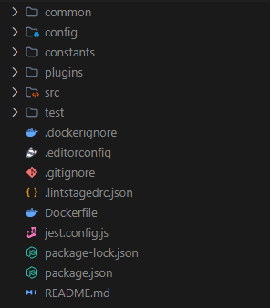
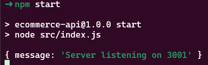

# Node.js API Template

## Descrição

Uma CLI para a criação de uma estrutura de projeto usando Fastify para a construção de APIs. Esta ferramenta gera um esqueleto de projeto pré-configurado, acelerando o desenvolvimento de APIs com Node.js.

## Tecnologias

- [Node.js](https://nodejs.org/api/v8.html)
- [Commander](https://www.npmjs.com/package/commander) - Para gerenciamento de comandos da CLI
- [fs-extra](https://www.npmjs.com/package/fs-extra) - Para manipulação de arquivos e diretórios
- [Inquirer](https://www.npmjs.com/package/inquirer) - Para prompts interativos

## Instalação da CLI

Clone o repositório e instale as dependências:

```bash
$ git clone https://github.com/seu-usuario/nodejs-api-template.git
$ cd nodejs-api-template
$ npm install
```

## Executando a CLI

Após a instalação das dependências, execute a CLI para criar um novo projeto:

```bash
$ npx cli init <nome-do-projeto>
```

Substitua `<nome-do-projeto>` pelo nome desejado para o diretório do seu projeto.

## Resultados

A CLI criará um diretório com o nome escolhido e configurará a estrutura de pastas estabelecida para o projeto. A estrutura do projeto será semelhante a esta:



### Executando o Swagger

1. Instale as dependências do projeto criado pela CLI:

   ```bash
   $ npm ci
   # ou
   $ npm install
   ```

2. Execute o servidor Fastify:

   ```bash
   $ npm start
   ```

   Você deve ver a seguinte saída:

   

3. Acesse a documentação Swagger no navegador utilizando a URL gerada:

   ```
   http://localhost:3001/api/<nome-do-seu-projeto>/docs/
   ```

   Substitua `<nome-do-seu-projeto>` pelo nome do projeto que você criou. Mantenha a escrita sem espaços e caracteres especiais. Exemplos:

   - `http://localhost:3001/api/ecommerceapi/docs/`
   - `http://localhost:3001/api/testapi/docs/`
   - `http://localhost:3001/api/ipsumapi/docs/`

## Contribuições

Contribuições são bem-vindas! Para contribuir, siga estes passos:

1. Crie uma branch com suas alterações:

   ```bash
   $ git checkout -b minha-branch
   ```

2. Faça suas alterações e commit:

   ```bash
   $ git add .
   $ git commit -m "Descrição das alterações"
   ```

3. Envie um pull request para o repositório principal.
